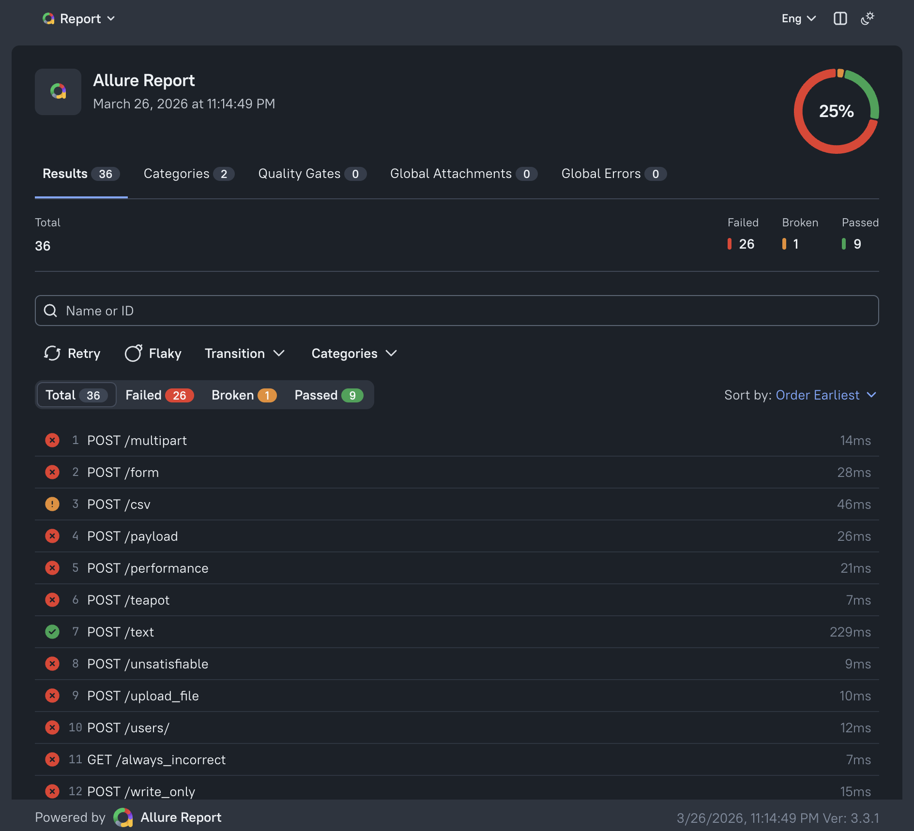
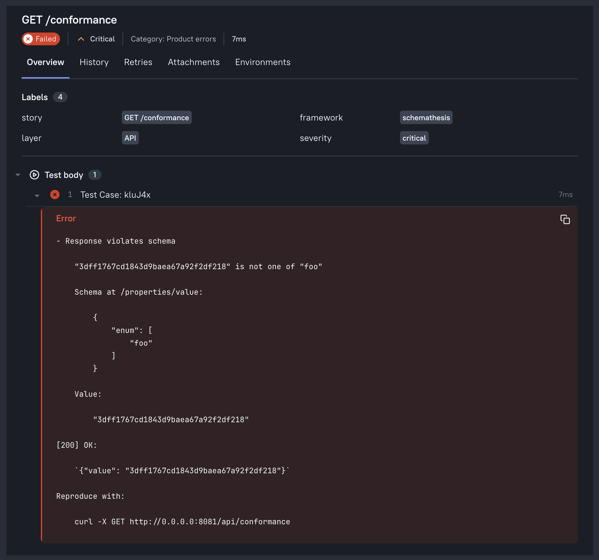

# Allure Integration

Export Schemathesis test results as [Allure report](https://allurereport.org/) files.

## Installation

Allure support is an optional extra:

```bash
uv add 'schemathesis[allure]'
```

This installs `allure-python-commons`. You also need the [Allure CLI](https://allurereport.org/docs/v3/install/) to generate and view the HTML report.

## CLI Usage

Pass `--report-allure-path` to write Allure result files to a directory:

```bash
uvx schemathesis run https://api.example.com/openapi.json \
    --report-allure-path allure-results
```

Then generate and open the report:

```bash
allure generate allure-results -o allure-report
allure open allure-report
```



You can also configure it in `schemathesis.toml` which will work for CLI & pytest plugin alike:

```toml
[reports.allure]
path = "allure-results"
```

## What the Report Shows

Each API operation becomes one Allure test result.

**Status** is `passed`, `failed`, `broken`, or `skipped`. A skip never masks a prior pass or failure — the highest-priority outcome wins.

**Failures** appear as one step per unique failing request, titled `Test Case: <id>`, with check names, response body, and a curl command to reproduce.



**Labels:**

| Label | Value |
|---|---|
| `story` | Operation label, e.g. `POST /users` |
| `framework` | `schemathesis` |
| `layer` | `API` |
| `epic` | API title from `info.title` (when present) |
| `feature` | OpenAPI operation tags (only set when tags exist) |

## Dynamic Allure API

Inside `@schema.parametrize()` tests, standard `allure` calls work and are routed to the Schemathesis-managed result for that operation.

```python
import allure


@schema.parametrize()
def test_api(case):
    allure.dynamic.title(f"Testing {case.method} {case.path}")
    allure.attach("extra context", name="note", attachment_type=allure.attachment_type.TEXT)
    allure.link("https://example.com/docs", name="API Docs")
    case.call_and_validate()
```

## Coexistence with allure-pytest

If you use `allure-pytest` in the same suite, keep its results in a separate directory to avoid mixing result schemas:

```bash
# Schemathesis results
uvx schemathesis run https://api.example.com/openapi.json \
    --report-allure-path allure-results/schemathesis

# allure-pytest results go to allure-results/pytest (controlled by --alluredir)
pytest tests/ --alluredir=allure-results/pytest
```

## Configuration Reference

See the [Reporting section](../reference/configuration.md#reporting) in the Configuration Options reference.
