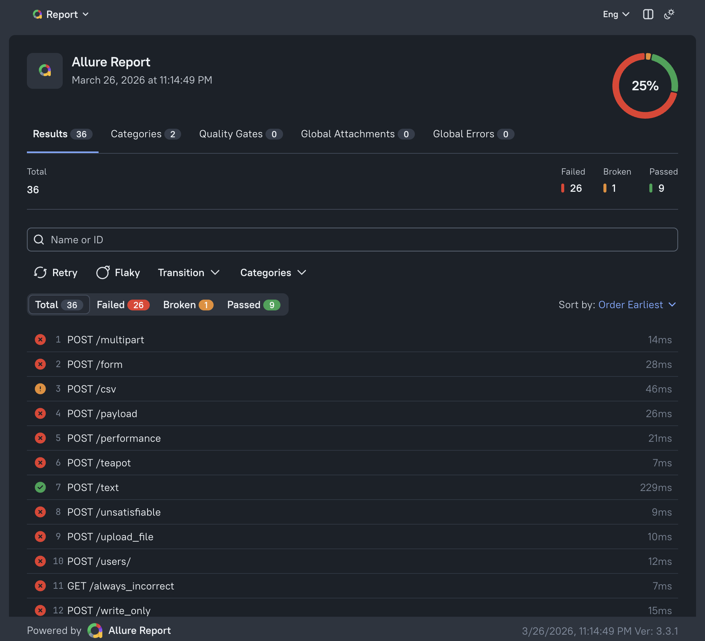
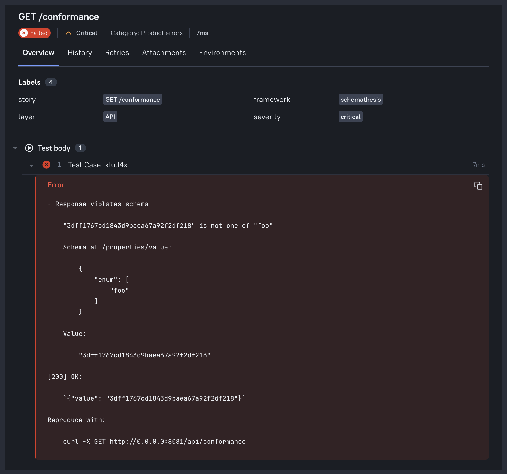

# Allure Integration

This guide shows how to export Schemathesis test results as [Allure report](https://allurereport.org/) files and turn them into an HTML report.

## Prerequisites

- The [Allure CLI](https://allurereport.org/docs/install/) to generate and view the HTML report
- Schemathesis with the `allure` extra (below), or the Docker image, which includes it

## Installation

Allure support is an optional extra:

```bash
uv add 'schemathesis[allure]'
```

This installs `allure-python-commons`. If you cannot install the extra, use [JUnit XML instead](#without-the-allure-extra-junit-xml).

## CLI Usage

Pass `--report-allure-path` to write Allure result files to a directory. With `uvx`, add the extra through `--from`:

```bash
uvx --from 'schemathesis[allure]' schemathesis run https://api.example.com/openapi.json \
    --report-allure-path allure-results
```

Each API operation is written as one `<uuid>-result.json` file in `allure-results/`. Then generate and open the report:

```bash
allure generate allure-results -o allure-report
allure open allure-report
```



You can also configure it in `schemathesis.toml` which will work for CLI & pytest plugin alike:

```toml
[reports.allure]
path = "allure-results"
```

## What the Report Shows

Each API operation becomes one Allure test result.

Failures appear as one step per unique failing request, titled `Test Case: <id>`, with check names, response body, and a curl command to reproduce.



Each result carries these labels:

| Label | Value |
|---|---|
| `story` | Operation label, e.g. `POST /users` |
| `framework` | `schemathesis` |
| `layer` | `API` |
| `epic` | API title from `info.title` (when present) |
| `feature` | OpenAPI operation tags (only set when tags exist) |
| `severity` | Highest severity among the operation's failures: `blocker`, `critical`, `normal`, or `minor` (only set on failure) |

## Dynamic Allure API

Inside `@schema.parametrize()` tests, standard `allure` calls work and are routed to the Schemathesis-managed result for that operation.

```python
import allure


@schema.parametrize()
def test_api(case):
    allure.dynamic.title(f"Testing {case.method} {case.path}")
    allure.attach("extra context", name="note", attachment_type=allure.attachment_type.TEXT)
    allure.link("https://example.com/docs", name="API Docs")
    case.call_and_validate()
```

## Coexistence with allure-pytest

If you use `allure-pytest` in the same suite, keep its results in a separate directory to avoid mixing result schemas:

```bash
# Schemathesis results
uvx --from 'schemathesis[allure]' schemathesis run https://api.example.com/openapi.json \
    --report-allure-path allure-results/schemathesis

# allure-pytest results go to allure-results/pytest (controlled by --alluredir)
pytest tests/ --alluredir=allure-results/pytest
```

## Docker

The Schemathesis Docker image has Allure support pre-installed. Create a directory, mount it and pass `--report-allure-path` to write raw result files to your host. Create the directory first: the container runs as UID 1000 and cannot write to a directory Docker creates as `root` (see [Docker troubleshooting](docker.md#troubleshooting)):

```bash
mkdir -p allure-results
docker run \
  -v ./allure-results:/app/allure-results \
  ghcr.io/schemathesis/schemathesis:stable \
  run --report-allure-path /app/allure-results \
  https://api.example.com/openapi.json
```

Then generate the report on your host using the [Allure CLI](https://allurereport.org/docs/install/):

```bash
allure generate allure-results -o allure-report
allure open allure-report
```

The Allure CLI is not included in the image — it is a separate Java tool. Run it on your host or in a dedicated CI step.

## Without the Allure extra: JUnit XML

Allure also reads JUnit XML. Export it with `--report junit` and copy it into an Allure results directory:

```bash
uvx schemathesis run https://api.example.com/openapi.json --report junit
mkdir -p allure-results
cp schemathesis-report/*.xml allure-results/
allure generate allure-results -o allure-report
allure open allure-report
```

JUnit XML carries less detail than the native format: the labels and per-test-case steps described above are not included.

## Troubleshooting

**`allure: command not found`.** The Allure CLI is a separate tool, not part of the Python package or the Docker image. [Install it](https://allurereport.org/docs/install/) on the machine that builds the report.

**`ModuleNotFoundError: No module named 'allure_commons'`.** The `allure` extra is not installed. Install `schemathesis[allure]`, or run `uvx --from 'schemathesis[allure]' schemathesis run ...`.

## Configuration Reference

See the [Reporting section](../reference/configuration.md#reporting) in the Configuration Options reference.
