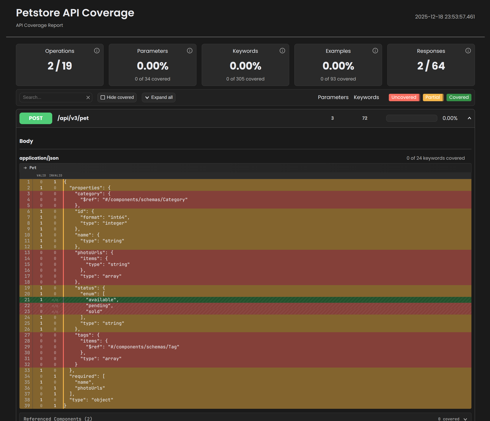

# Schema Coverage

Measure schema-level API coverage down to individual keywords using [TraceCov](https://docs.tracecov.sh).

TraceCov tracks whether your tests exercise specific schema constraints like `minLength`, `pattern`, and `enum` values - not just whether endpoints were called.

## Setup

Install TraceCov:

```bash
uv pip install tracecov
```

Create a hooks file to enable coverage tracking:

```python
# hooks.py
import tracecov

tracecov.schemathesis.install()
```

Run Schemathesis with the hooks:

```bash
SCHEMATHESIS_HOOKS=hooks schemathesis run https://api.example.com/openapi.json
```

TraceCov generates an HTML report at `./schema-coverage.html` after tests complete.

## Coverage Report

The report shows coverage across five dimensions:

- **Operations** — HTTP method and path combinations invoked
- **Parameters** — Path, query, header, cookie, and body values tested
- **Keywords** — JSON Schema validation rules exercised (`minLength`, `pattern`, `enum`, etc.)
- **Examples** — Schema examples and default values used
- **Responses** — HTTP status codes returned by the API

Colors indicate coverage status:

- :green_circle: **Green** — Fully covered
- :yellow_circle: **Yellow** — Partially covered (e.g., valid inputs tested, but not invalid)
- :red_circle: **Red** — Not covered



<div style="text-align: center" markdown>

[:material-open-in-new: View Interactive Demo](https://demo.tracecov.sh){ .md-button .md-button--primary }

</div>

For more details, see the [TraceCov documentation](https://docs.tracecov.sh).
