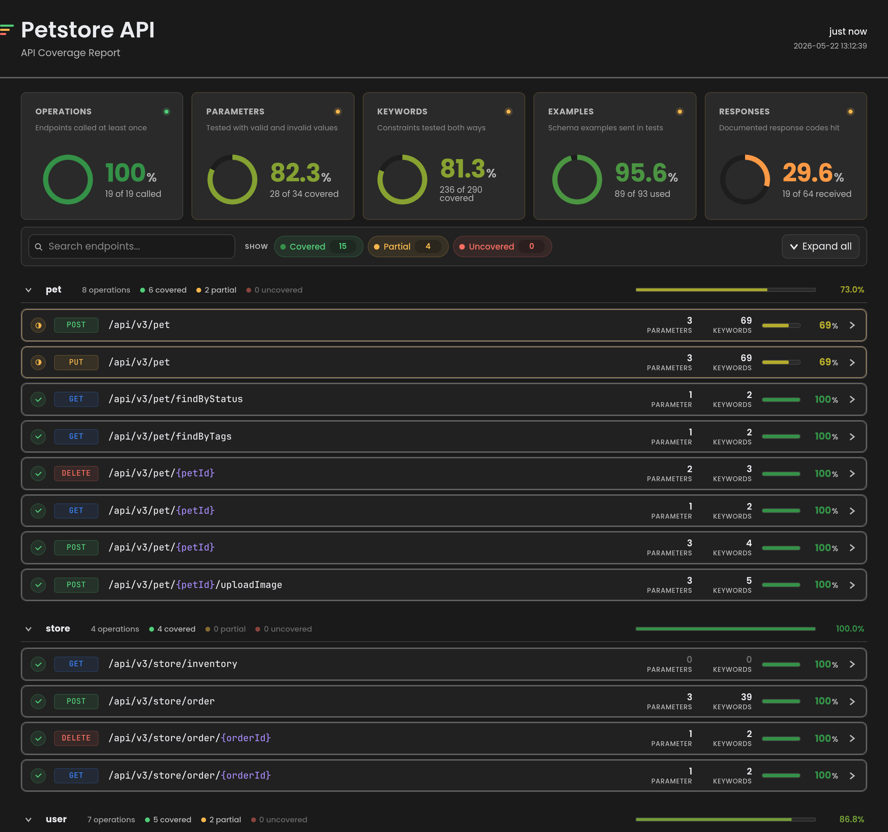

# Schema Coverage

Measure schema-level API coverage down to individual keywords using [TraceCov](https://docs.tracecov.sh).

TraceCov tracks whether your tests exercise specific schema constraints like `minLength`, `pattern`, and `enum` values - not just whether endpoints were called.

## Setup

Install TraceCov:

```bash
uv pip install tracecov
```

Create a hooks file to enable coverage tracking:

```python
# hooks.py
import tracecov

tracecov.schemathesis.install()
```

Run Schemathesis with the hooks:

```bash
SCHEMATHESIS_HOOKS=hooks schemathesis run https://api.example.com/openapi.json
```

TraceCov generates an HTML report at `./schema-coverage.html` after tests complete.

## Coverage Report

The report shows coverage across five dimensions:

- **Operations** — HTTP method and path combinations invoked
- **Parameters** — Path, query, header, cookie, and body values tested
- **Keywords** — JSON Schema validation rules exercised (`minLength`, `pattern`, `enum`, etc.)
- **Examples** — Schema examples and default values used
- **Responses** — HTTP status codes returned by the API

Colors indicate coverage status:

- :green_circle: **Green** — Fully covered
- :yellow_circle: **Yellow** — Partially covered (e.g., valid inputs tested, but not invalid)
- :red_circle: **Red** — Not covered



<div style="text-align: center" markdown>

[:material-open-in-new: View Interactive Demo](https://demo.tracecov.sh){ .md-button .md-button--primary }

</div>

For more details, see the [TraceCov documentation](https://docs.tracecov.sh).

## Improving Coverage

Schemathesis automatically targets schema constraints through its coverage phase, generating boundary values, pattern-matching strings, enum values, and more. For constraints that remain partially covered (yellow), add explicit examples to your schema. Schemathesis uses `example` (single value) and `examples` (map of example objects) as test cases:

```yaml
/users/{id}:
  get:
    parameters:
      - name: id
        in: path
        schema:
          type: integer
          minimum: 1
        examples:
          existing:
            value: 42
          boundary:
            value: 1
```

For cases where neither the coverage phase nor explicit examples are sufficient, [hooks](../reference/hooks.md) let you control generation directly - filtering values, mapping them to specific shapes, or replacing a strategy entirely.

## Docker

The official Schemathesis Docker image has tracecov pre-installed and enabled by default. The coverage report is written to `/app/schema-coverage.html` inside the container. Mount a host directory and override the path to retrieve it:

```bash
docker run \
  -v ./reports:/app/reports \
  -e SCHEMATHESIS_COVERAGE_REPORT_HTML_PATH=/app/reports/schema-coverage.html \
  ghcr.io/schemathesis/schemathesis:stable \
  run -w auto https://api.example.com/openapi.json
```

### Opt out

Set `SCHEMATHESIS_COVERAGE=false` to disable coverage tracking entirely:

```bash
docker run -e SCHEMATHESIS_COVERAGE=false \
  ghcr.io/schemathesis/schemathesis:stable \
  run -w auto https://api.example.com/openapi.json
```

### Custom hooks

When you mount your own `hooks.py` at `/app/hooks.py`, it replaces the built-in stub. Add the tracecov activation lines at the top to keep coverage enabled:

```python
import tracecov
tracecov.schemathesis.install()

# your hooks below
import schemathesis

@schemathesis.hook
def before_generate_query(context, strategy):
    ...
```

Or set `SCHEMATHESIS_COVERAGE=false` to skip tracecov without touching your hooks file.
