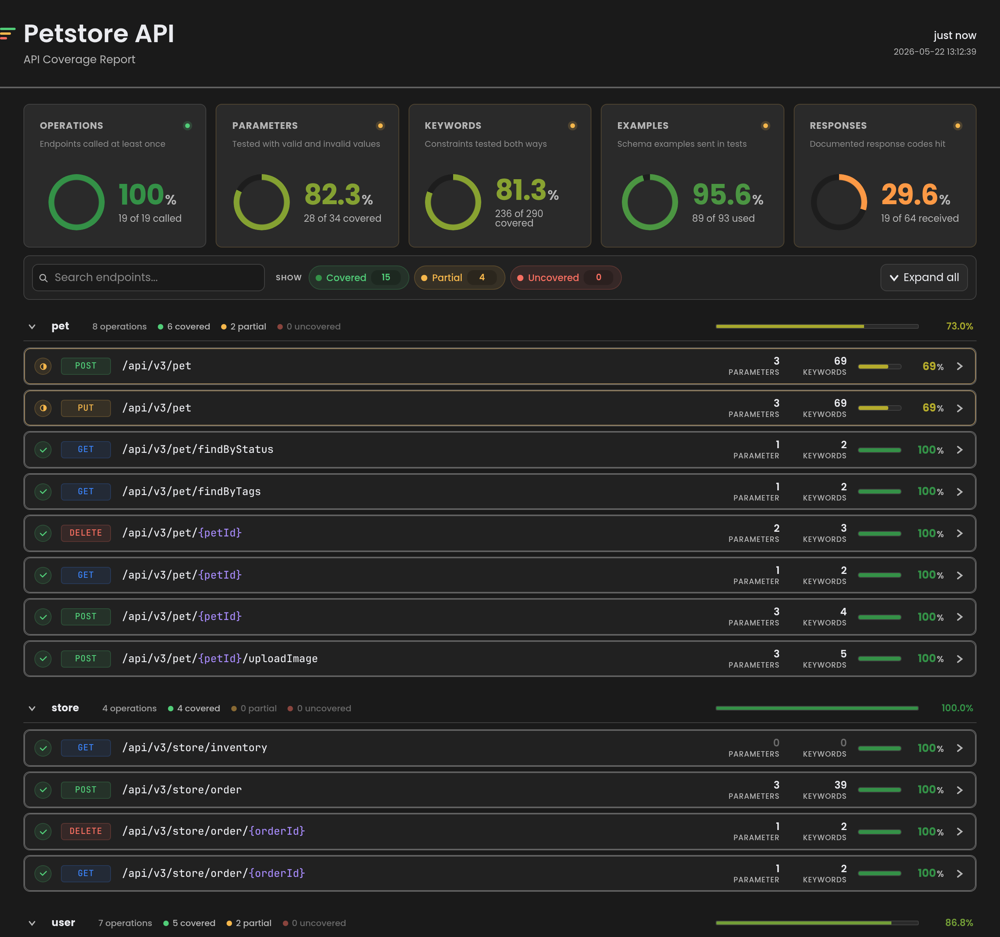

# Schema Coverage

Measure schema-level API coverage down to individual keywords using [TraceCov](https://docs.tracecov.sh).

TraceCov tracks whether your tests exercise specific schema constraints like `minLength`, `pattern`, and `enum` values - not just whether endpoints were called.

## Prerequisites

- A running API and its schema URL
- [uv](https://docs.astral.sh/uv/) for `uvx`, or a virtual environment with Schemathesis installed

TraceCov runs inside the Schemathesis process, so it must be installed in the same environment as Schemathesis.

## Setup

1. Create a hooks file that enables coverage tracking:

    ```python
    # hooks.py
    import tracecov

    tracecov.schemathesis.install()
    ```

2. Run Schemathesis with TraceCov added to its environment and the hooks loaded:

    ```bash
    export SCHEMATHESIS_HOOKS=hooks
    uvx --with tracecov schemathesis run https://api.example.com/openapi.json
    ```

    If Schemathesis is installed in a virtual environment instead, install TraceCov there (`pip install tracecov`) and run `schemathesis run` as usual.

At the end of the run you should see:

```
Schema Coverage report: ./schema-coverage.html
```

Open `schema-coverage.html` in a browser.

## Coverage Report

The report shows coverage across five dimensions:

- **Operations** — HTTP method and path combinations invoked
- **Parameters** — Path, query, header, cookie, and body values tested
- **Keywords** — JSON Schema validation rules exercised (`minLength`, `pattern`, `enum`, etc.)
- **Examples** — Schema examples and default values used
- **Responses** — HTTP status codes returned by the API

Colors indicate coverage status:

- :green_circle: **Green** — Fully covered
- :yellow_circle: **Yellow** — Partially covered (e.g., valid inputs tested, but not invalid)
- :red_circle: **Red** — Not covered



<div style="text-align: center" markdown>

[:material-open-in-new: View Interactive Demo](https://demo.tracecov.sh){ .md-button .md-button--primary }

</div>

For more details, see the [TraceCov documentation](https://docs.tracecov.sh).

## Reading the Numbers

Treat an uncovered constraint as a task: add an example, correct the schema, or reach the state that produces that response. Treat the percentage as a description of what was reached rather than a score to raise; a higher percentage between two configurations or tools does not mean more defects found ([Böhme et al., ICSE 2022](https://doi.org/10.1145/3510003.3510230)).

A drop between releases of the same schema is worth acting on: constraints that used to be exercised and no longer are point at a real change in the schema or in the tests.

## Improving Coverage

Schemathesis automatically targets schema constraints through its coverage phase, generating boundary values, pattern-matching strings, enum values, and more. For constraints that remain partially covered (yellow), add explicit examples to your schema. Schemathesis uses `example` (single value) and `examples` (map of example objects) as test cases:

```yaml
paths:
  /users/{id}:
    get:
      parameters:
        - name: id
          in: path
          required: true
          schema:
            type: integer
            minimum: 1
          examples:
            existing:
              value: 42
            boundary:
              value: 1
```

For cases where neither the coverage phase nor explicit examples are sufficient, [hooks](../reference/hooks.md) let you control generation directly - filtering values, mapping them to specific shapes, or replacing a strategy entirely.

The **Responses** dimension records status codes the API actually returned, so it does not always reach 100%. Documented statuses that require server state - `409 Conflict`, `429 Too Many Requests`, `503 Service Unavailable` - stay uncovered until a test puts the API in that state. [Stateful testing](stateful-testing.md) reaches some of them by chaining linked operations; the rest need a request your own tests make.

## Docker

The official Schemathesis Docker image has TraceCov pre-installed and enabled by default. The coverage report is written to `/app/schema-coverage.html` inside the container. Mount a host directory and override the path to retrieve it:

```bash
mkdir -p reports
docker run \
  -v ./reports:/app/reports \
  -e SCHEMATHESIS_COVERAGE_REPORT_HTML_PATH=/app/reports/schema-coverage.html \
  ghcr.io/schemathesis/schemathesis:stable \
  run -w auto https://api.example.com/openapi.json
```

The container runs as a non-root user (`schemathesis`, UID 1000). Create `reports` before mounting it, because a directory Docker creates for the mount is owned by `root`. If your host UID (`id -u`) is not 1000, also run `chmod a+w reports`. Otherwise the run ends with `Could not write the coverage report: [Errno 13] Permission denied`. See [Docker](docker.md) for details.

### Opt out

Set `SCHEMATHESIS_COVERAGE=false` to disable coverage tracking entirely:

```bash
docker run -e SCHEMATHESIS_COVERAGE=false \
  ghcr.io/schemathesis/schemathesis:stable \
  run -w auto https://api.example.com/openapi.json
```

### Custom hooks

When you mount your own `hooks.py` at `/app/hooks.py`, it replaces the built-in stub. Add the TraceCov activation lines at the top to keep coverage enabled:

```python
import tracecov

tracecov.schemathesis.install()

# your hooks below
import schemathesis


@schemathesis.hook
def before_generate_query(context, strategy): ...
```

`SCHEMATHESIS_COVERAGE=false` applies only to the built-in hooks file. With your own hooks file, remove the TraceCov lines to disable coverage.

## Troubleshooting

**`ModuleNotFoundError: No module named 'tracecov'`** when loading hooks: TraceCov is not in the environment that runs Schemathesis. With `uvx`, add `--with tracecov`; a separate `uv pip install tracecov` or `pipx install tracecov` does not reach the `uvx` environment.

**No `Schema Coverage report:` line at the end of the run**: The hooks file was not loaded; check `SCHEMATHESIS_HOOKS`.
